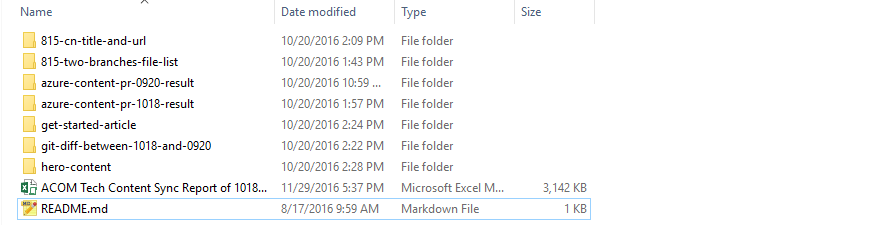
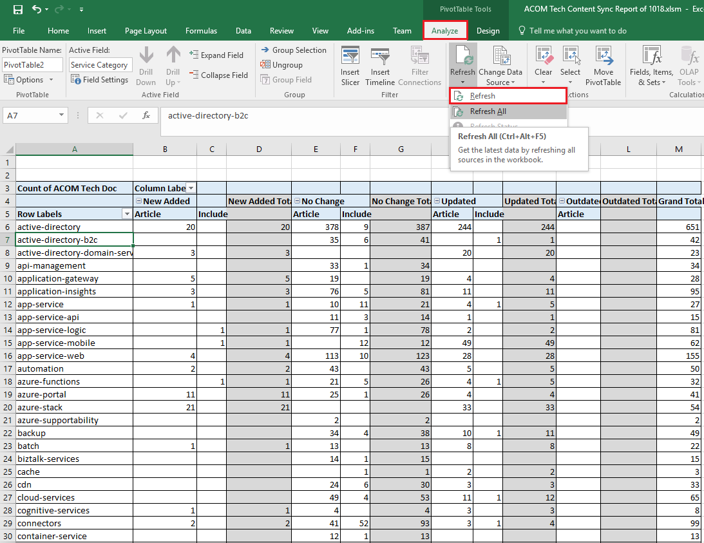

# ACOM Monthly Report

## Get data Steps

1. 815-two-branches-file-list: 

	```bash
	# master & stage
	find articles/ -type f -name "*.md" -printf "%f\n" > master.txt 2>error.txt
	find includes/ -type f -name "*.md" -printf "%f\n" > master-include.txt 2>error.txt
	find articles/ -type f -name "*.md" -printf "%f\n" > stage.txt 2>error.txt
	find includes/ -type f -name "*.md" -printf "%f\n" > stage-include.txt 2>error.txt
	```
2. azure-content-pr-current-result:

	```bash
	git checkout current_hash && acom.sh
	```
3. azure-content-pr-last-result:
	
	```bash
	git checkout last-hash && acom.sh
	```
4. 815-cn-title-and-url
	
	```bash
	# Use file list with relative path.
	cp current_acom_articles_file_list_with_path 815/articles/
	git checkout stage && acn.sh acom_articles_list.txt
	```	
5. git diff
	
	```bash
	# 2e6bf868: last sync hash
	git diff --name-status 6a3b02c9 includes/
	```	
6. Hero content & get-started-article:
	
	```bash
    cd azure-content-pr/articles/ && grep -r -l "hero-article" . | xargs -L 1 basename
    
    grep -r -l 'ms.topic="get-started-article"' . | xargs -L 1 basename
	```
	
7. You could organize previous data into folder like below to make simplicity.

    


## Excel Report

There are 12 sheets that you could put previous data directly to it, they are:

1. **Hero Content**: hero content
2. **Get-Started-Article**: get started articles
3. **815-Title**: 815-cn-title-and-url
4. **article-result**: azure-content-pr-current-result
5. **include-result**: azure-content-pr-current-result

    > The service should be checked by hand since they are all in the same folder.
    
6. **article-result-old**: azure-content-pr-last-result
7. **include-result-old**: azure-content-pr-last-result
8. **815-Master**: 815-two-branches-file-list
9. **815-Stage**: 815-two-branches-file-list
10. **815-Master-include**: 815-two-branches-file-list
11. **815-Stage-include**: 815-two-branches-file-list
12. **Git-include-0816**: 815-two-branches-file-list

#### Handle Sheet *Articles* and *Includes* and *ALL*
After finish pervious sheets the *Articles* sheet data should be generated automatically. 

> To make sure the correctness of these data, you should always go to the lowest line to check if all the data were applied with formula. You could see the reference when look into the formula, and below are some of them.

| Column | Reference |
| ------ | ------ |
| URL/Repo path(E) | **article-result** Column A |
| Title(F) | **article-result** Column D |
| Last update time(I) | **article-result** Column C |

> **Includes** sheet are the same way of **Articles**.
> **ALL** sheet is just a combine data of **Articles** and **Includes**.

#### All-Analytics
This is the last step of our process, you should always refresh datasource to make sure our result to be the correct and newest.



and **ACOM ALL** Sheet are just a copy of **All-Analytics**, you can copy anly need data from **All-Analytics** to **ACOM ALL**.

