# KPI

## 1. Tools

>**Tips**: Add these tools folder path to the system environment path so that you could use it anywhere.

#### run.sh
   - Usage: cd 815/articles/ && run.sh
   - Result: three files, they are
    - ***KPI.csv***: Format: FileName, ServiceName, wacnDate
    - ***error.txt***: Files don't contain ***ms.service*** nor ***wacn.date***, you should find their service or date and add them to KPI.csv.
    - ***file.txt***: file list in articles/ folder.
	    

## 2. Steps
### KPI-Report-10.xlsx
1. **Get Clean Data**: Checkout and cherry pick all the commits this month to a standalone branch.
2. **Get 815 KPI data**: 
    1. `cd 815 && run.sh`, you'll get 3 files mentioned above.
        
        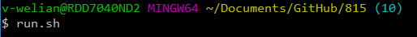
        *2.1.1: input command*
        
        
        *2.1.2: processing*
        
        
        *2.1.3: done*
        
    2. Add files in error.txt to KPI.csv after find its service or date.
    3. Then open **KPI-Report-10.xlsx** and navigate to **var** sheet to change date.
    
        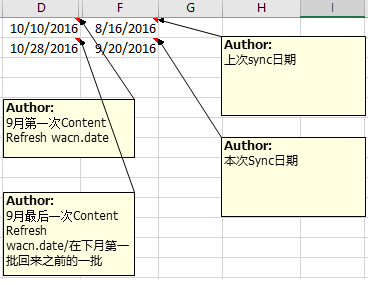  
        *2.3.1:Change var date*
        
    4. Navigate to Sheet **KPI-SRC**, import KPI.csv to this sheet.
        
        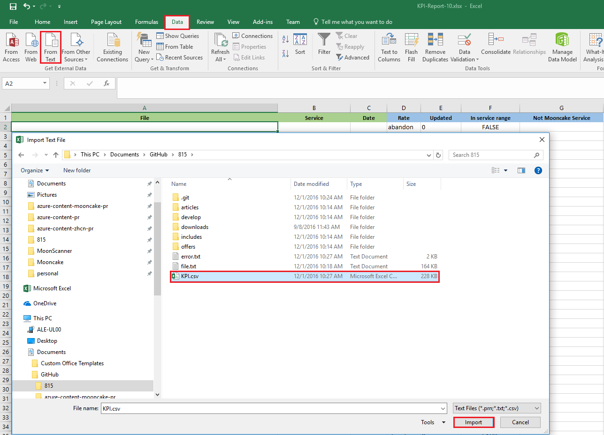
        *2.4.1: import csv*
        
        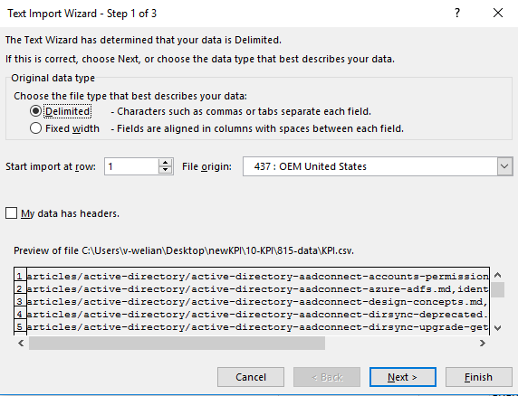
        *2.4.2: import step1 **
        
        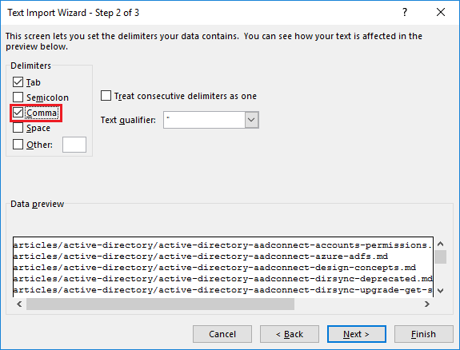
        *2.4.3: select comma*
        
        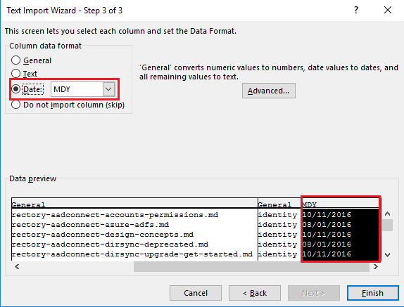
        *2.4.4: choose date format of marked column*
        
        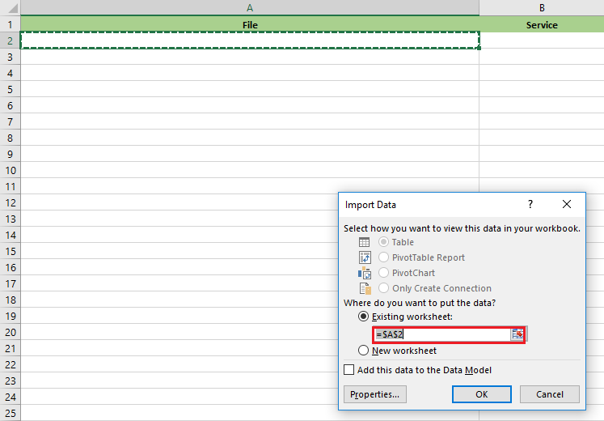
        *2.4.5: select location to put the data*

    5. You can filter the column to verify data.
        1. **Updated**: 1->updated, 0:not updated.
        2. **In service range**: If Column B is a valid service, the service list in is defined in Sheet **var** Column B.
        3. **Not Mooncake Service**: MySQL,CDN,AOG and etc are not matained by us so should be filtered out.
        
            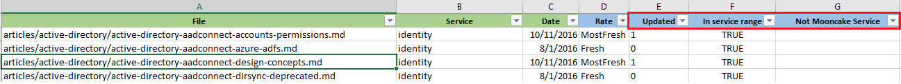
            *2.5.1: filter resuts*
        
    4. KPI-RESULT sheet data and graph will updated automatically, 50% completion now.
        
3. Get ACOM vs 815 data by **RongJieTool** at Desktop.
    1. Open the project and run it.
    2. Select 815 root folder and acom root folder, then click run.
    
        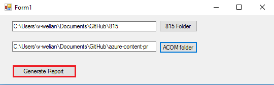
        *3.2.1:generate report*
        
    3. You'll get a result.csv in the *GithubComparer_src\GithubComparer\GithubComparer\bin\Debug* folder.
    4. Import result.csv to Sheet **RJ-tool-result** like before, then you could get update status.
        
        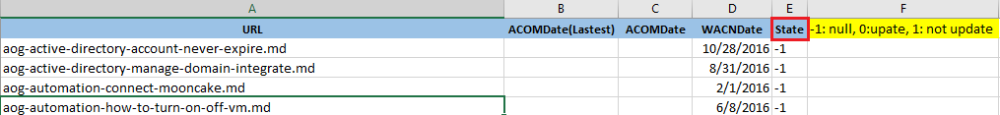
        *3.4.1: rj-status*
        
4. Get missing update files list
    1. Copy ACOM update files list from sheet "RJ-tool-result" into Column A in sheet "应该更新未更新".
    2. Copy ACN update files list from sheet "KPI-SRC" into Column B in sheet "应该更新未更新".
    3. Filter Column "应该更新已更新" to FALSE, then you can got the missing files list.
    
        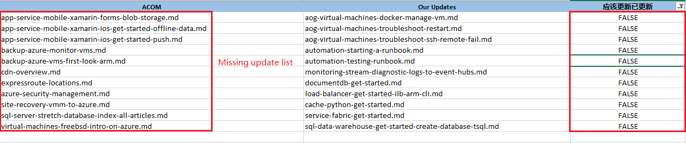
        *4.3.1: missing update list*
        
5. Get real added files list
    1. Copy current 815 articles files list into Column A in Sheet "815 August vs July".
    2. Copy last month 815 articles files list into Column B in Sheet "815 August vs July".
    3. Filter **FALSE** in Column C, then you could get real added files in Column A.

        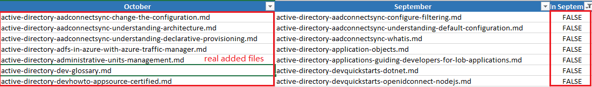
        *5.3.1: real added files*
        
### New-KPI.xlsx
There are 7 sheets you should put data from pervious step's data.

1. **ACN**: all the 815 articles files list
2. **New article for existing**: data from pervious section ***Get real added files list***
3. **ACOM remove file**: Filter Sheet *RJ-tool-result* with *State* = -1
4. **ACN update**: Filter Sheet *KPI-SRC* with *Updated* = 1
5. **ACOM no update**: Filter Sheet *RJ-tool-result* with *State* = 1
6. **ACOM Update but ACN not Update**: data from previous section ***Get missing update files list***
7. **Mooncake Only**: Filter Sheet *KPI-SRC* with *Not Mooncake Service* = TRUE, you should check manually since it may be changed in the last month.

Then you could checkout Sheet **Result** in **New-KPI.xlsx**, the data was caculated automatically.

> To make sure the result is accurate, you could filter columns below to be FALSE **from left to right**, since every file should only has one of these seven states, it can't be all FALSE.
>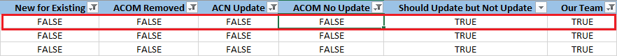
> *verify state*