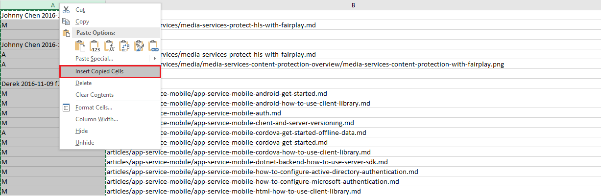
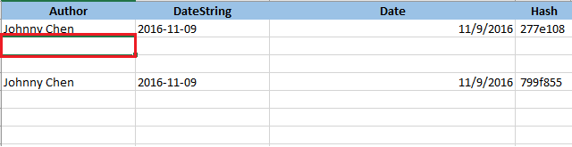
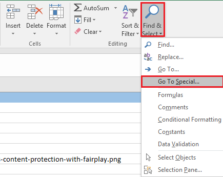
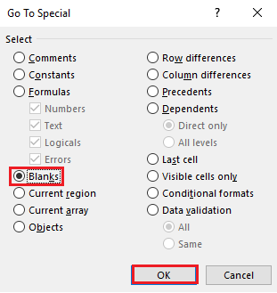
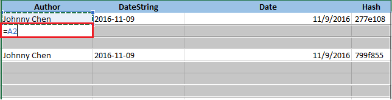
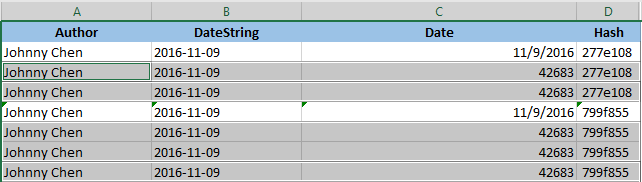
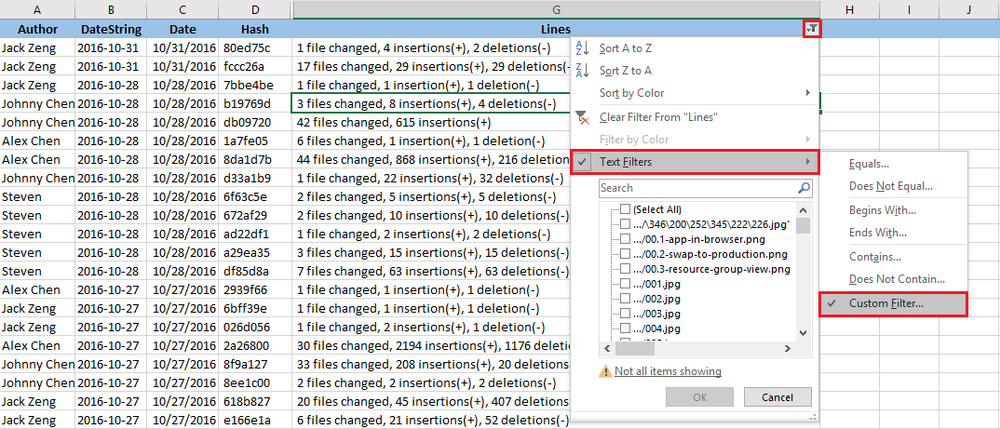
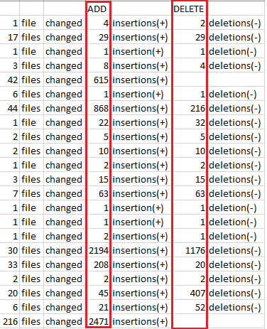
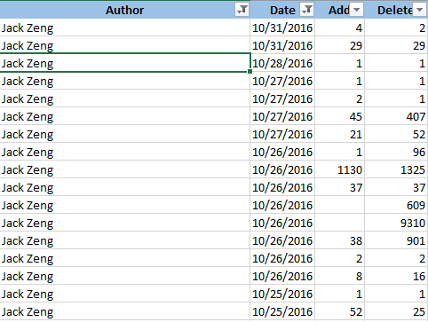

# CommitsReport

### 1. Get log

        git log --pretty=format:"%an %cd %h" --date=short --name-status --since="2016/01/01" --before="2016/10/31" > sumFile.txt
        
        git log --oneline --stat --since="2016/01/01" --before="2016/10/31" > sumLine.txt

### 2. File Report

1. Import sumFile.txt to excel and import sumLine.txt right next to it, since they are the same lines.

    
    copy cells
    
2. Insert 4 blank columns before Column A, and apply formula to Column D which contains Author&Date&Hash.

    | Author(A) | DateString(B) | Date(C) | Hash(D) |
    | --------- | ------------- | ------- | ------- |
    | =LEFT(E2, LEN(E2)-19) | = LEFT( RIGHT(E2,18), 10) | =DATE(LEFT(B2,4),MID(B2,6,2), RIGHT(B2,2)) | =RIGHT(E2,8) |
    
3. Then filter Column State with only `Author Date Hash` string, and apply these formula to all these lines.

    

4. Then cancel the filter and we're going to filling blank fields.
    
    1. Hide all the columns except (Author, DateString, Date, Hash), and then select the very first blank cell under desired cell.
    
        
        
    2.  click menu **Home -> Find&Select -> Go To Speicial**
    
        
       
    3. Select *blanks* to choose all the blanks in current sheet.
    
        
    
    4. Input reference formua `=A2`, then **Ctrl+Enter**, then all the blanks will follow the same behavior(not the same cell) to fill rest of blanks.
        
        
        
        
        
    5. Then you can filtering result by users/Date, just copy Column **Author**, **Date** and **State** to sheet **All-File**, and then you will get file report at sheet **File-Report** automatically.

### Lines Report

1. For the lines changes, make custom filter all the lines contain "file changed" or "files changed".
    
    
    
2. Save column **lines** to a local file and re-improt it to excel separated by **,**.
    
    
    
3. Copy these columns with Column **Author**, **Date** and **State** to Sheet **All-Lines**, then you will get line report at sheet **Line-Report** automatically.
    
    
    
4. The chart also refresh automatically.
